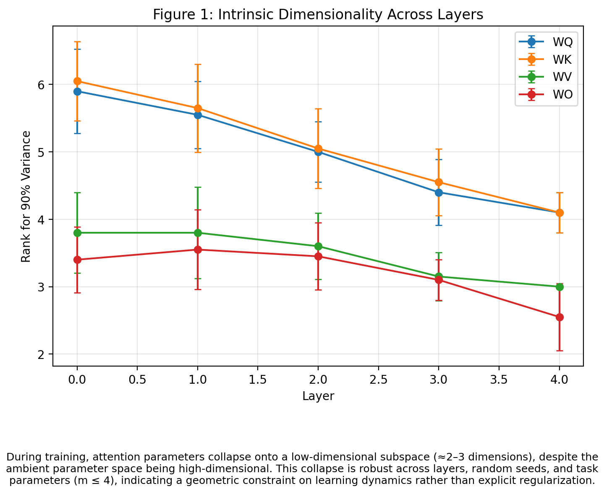
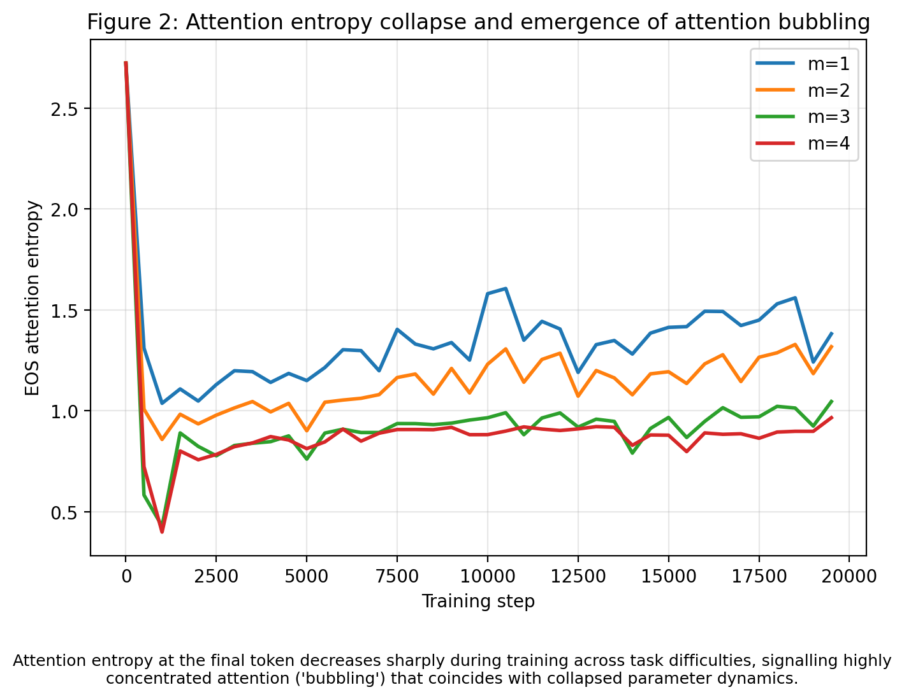
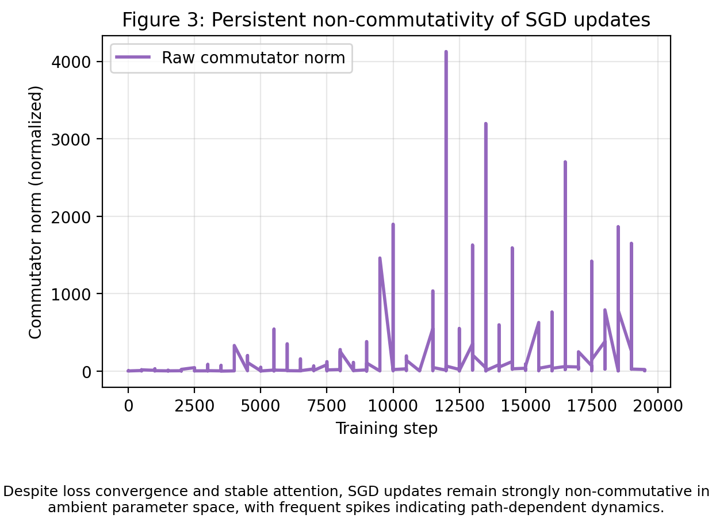
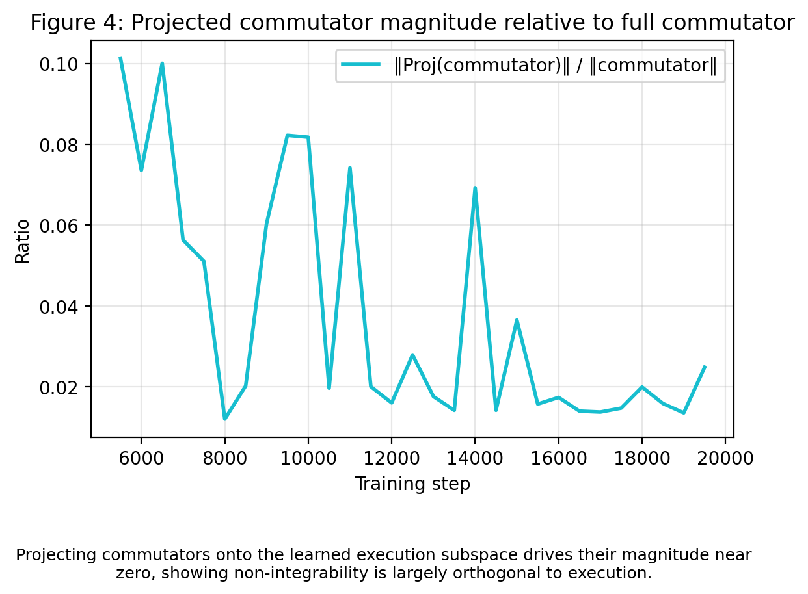
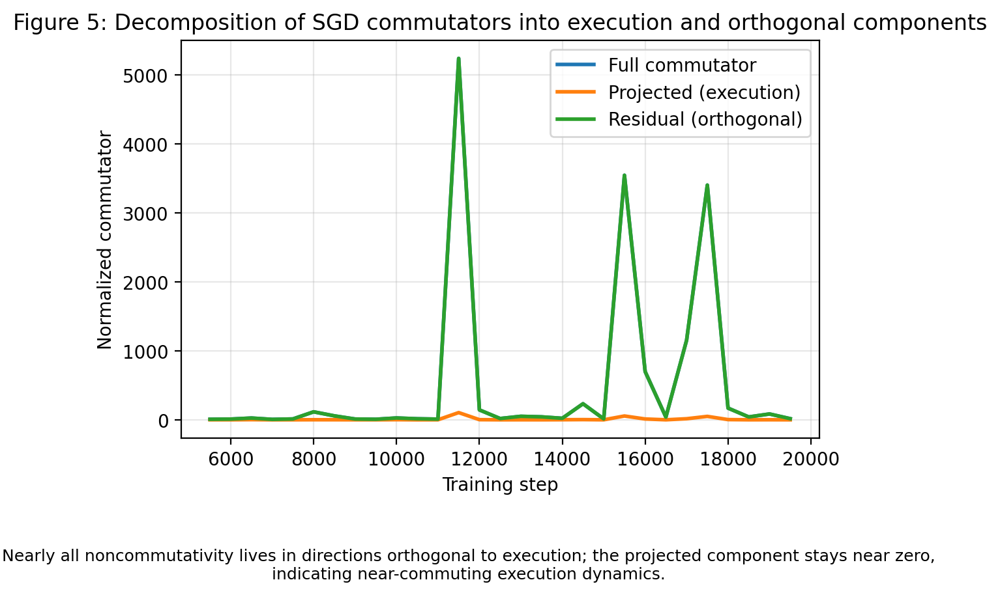
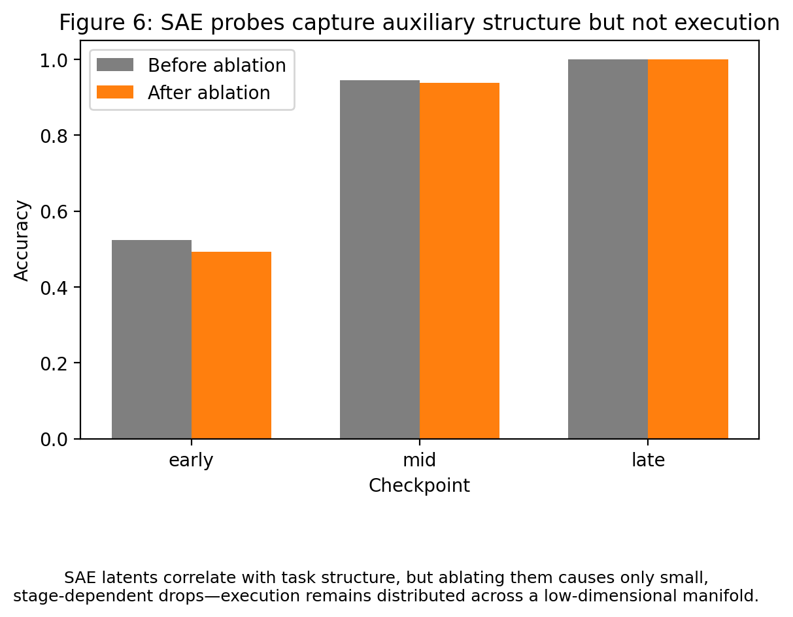

# **bubble-modadd**  
***Learning Geometry and Training Dynamics***  
> 
> ### Main Results (TL;DR)
>
> - In controlled modular-addition tasks, transformer training dynamics collapse onto a low-dimensional execution manifold (≈2–3D).  
> - Although SGD updates are strongly non-commutative in ambient parameter space, this non-integrability is confined to directions orthogonal to the execution manifold.  
> - When projected onto the learned execution subspace, SGD commutators are negligible, indicating approximately integrable dynamics along execution directions.  
> - Attention “bubbling,” circuit formation, and robustness emerge as geometric consequences of this collapse.  
> - Sparse autoencoders capture auxiliary routing structure but do not isolate execution itself.

### Summary

This repository explores the **training dynamics** of transformer models through a carefully controlled, **marker-based modular addition** task.

The primary focus is not on achieving state-of-the-art performance, but on understanding the **geometric structure** of how learning actually happens in overparameterized networks.

We investigate:

- How overparameterized transformers discover and encode **structured computation**
- The emergence of interpretable **attention patterns** and modular **circuits**
- The surprising behavior of **stochastic optimization** (SGD) along — and especially *across* — the learned family of solutions

**Core discovery**  
During training, the high-dimensional parameter trajectories rapidly **collapse** onto a low-dimensional **execution subspace** (≈2–3 dimensions in this task). Nearly all meaningful progress in learning the task occurs inside this tiny subspace, while stochasticity, task interference, and most SGD noise are absorbed in the vast orthogonal complement.

This geometric collapse appears to underlie several intriguing phenomena including attention "bubbling", robust circuit formation, approximate integrability of SGD along execution directions, and the limitations of current sparse autoencoder-based interpretability approaches.

# 🔍 Motivation

Transformer models often exhibit:
- sharp attention concentration (“bubbles”),
- grokking-like generalization transitions,
- interpretable circuit structure.
- surprising robustness despite noisy SGD dynamics.

These phenomena are frequently studied in isolation.

This work proposes a unifying geometric explanation:**

**-Training dynamics rapidly collapse onto a low-dimensional execution manifold.**

**-Many of the most intriguing empirical observations — attention bubbling, abrupt grokking-style generalization, circuit formation, and robustness to noise — are natural consequences (i.e. projections) of this severe dimensional collapse.**

From this perspective, the central object of study is no longer the final trained network viewed as a static function, but rather **the trajectory of learning itself** — the geometry and dynamics of the path through parameter space.

# 🧪 Task: Marker-Based Modular Addition
- Sequences of length T = 32
- m marked positions (non-adjacent), indicated by marker tokens
- Each marker is followed by a value token
- The label is the sum of the marked values modulo C
- Remaining tokens are i.i.d. distractors

Task difficulty is controlled via:
- number of markers m
- number of classes C
- curriculum vs mixed-data sampling

# 🧠 Models

We study transformer variants with:
- **Attention-only** models (no MLP layers)
- **Standard** transformer blocks (attention + MLP)

This allows direct comparison of how architectural expressivity affects training geometry.

# 📊 Key Findings

1. **Collapse onto a Low-Dimensional Execution Manifold**  
   In attention-only transformers, the attention parameters  (`W_Q`, `W_K`, `W_V`, `W_O`) rapidly collapse during training onto a **2–3 dimensional subspace**.  

   This collapse is:  
   - consistent across layers  
   - stable across random seeds  
   - robust for moderate task difficulty (e.g. `m ≤ 4`)  

   The phenomenon reflects a deep constraint on **learning dynamics**, not the result of explicit regularization or pruning.
<!-- Optional: centered version with caption -->
<p align="center">
  
  <br>
</p>

2. **Attention Bubbling as Geometric Saturation**  
   Sharp attention concentration (“**attention bubbles**”) emerges naturally as **saturation** along a routing coordinate within the reduced execution manifold.  

   Bubbling is **not** a discrete architectural quirk, but rather the continuous projection of movement along a low-dimensional learning trajectory.
<!-- Optional: centered version with caption -->
<p align="center">
  
  <br>
</p>
   

3. **Non-Integrability of SGD and Commutator Analysis**  
   Despite the dramatic dimensional collapse, SGD updates remain **strongly non-commutative** in the full high-dimensional parameter space.  

   We quantify this via **SGD commutators**  
   `θ_AB - θ_BA` (computed from sequential gradient steps on independent minibatches).  

   Key observations:  
   - Raw commutator norms stay large and frequently **spike**, even late in training  
   - These spikes correlate only **weakly** with loss fluctuations  

   **Crucially**: When commutators are projected onto the learned execution subspace, their magnitude becomes **negligible**.  
   → SGD dynamics are **approximately integrable** along execution directions  
   → Non-integrability is confined to the vast orthogonal “staging” directions.
   <!-- Optional: centered version with caption -->
 <p align="center">
   
   <br>
 </p>

4. **Localization of Noncommutativity**  
   Decomposing commutators into:  
   - components **within** the execution subspace  
   - components **orthogonal** to it  

   reveals that:  
   - nearly **all** noncommutativity lives **outside** the execution manifold  
   - execution dynamics themselves support **near-commuting** updates  

   This suggests a fundamental geometric role for overparameterization:  
   extra dimensions **absorb optimization interference** without disrupting the core execution computation.
   <p align="center">
   
   <br>
  </p>
    <p align="center">
    
    <br>
   </p>

5. **Sparse Autoencoders as Supporting Evidence**  
   We train sparse autoencoders (SAEs) on intermediate activations to probe internal representations.  

   Results:  
   - A small number of SAE latents correlate with task structure (e.g. marker count `m`)  
   - Ablation of these latents causes small, **stage-dependent** accuracy drops  
   - Largest sensitivity occurs **mid-training** and diminishes late  

   **Most importantly**:  
   - SAE latents **do not isolate execution itself**  
   - Execution remains **distributed** across the low-dimensional manifold  

   → SAEs highlight a clean separation between **execution geometry** and **auxiliary routing / staging structure**.
   <p align="center">
       
   <br>
   </p>

7. **Architectural Sensitivity**  
   Adding MLP layers **disrupts** the low-dimensional geometric picture:  
   - Attention parameters no longer collapse to low dimension  
   - Training dynamics remain **higher-dimensional**  
   - Generalization degrades under comparable training budgets  

   This indicates a tight coupling between **attention-based routing** and low-dimensional execution dynamics.

8. **Path Dependence and Forgetting**  
   Under strict curriculum learning (progressively increasing `m`):  
   - Performance on **smaller m** degrades as training advances to larger `m`  
   - Despite the model having **sufficient capacity**  

   This behavior is consistent with **path-dependent** movement along a low-dimensional solution manifold, rather than independent memorization of each task variant.

# 📐 Analysis Tools

This repository provides a suite of diagnostic tools to analyze training dynamics and representations:

- **Intrinsic dimensionality** via effective rank estimation
- **PCA subspace alignment** across layers, seeds, and tasks
- **Attention bubbling metrics** (concentration and saturation)
- **Attention entropy** and other distribution statistics
- **SGD commutator** computation & **projected-commutator** analysis — to separate integrable vs. non-integrable directions
- **Sparse autoencoder** training, probing, and targeted **ablations** — for dissecting routing vs. execution structure
<!--
- **Distance to final low-dimensional subspace** during training 
-->

All metrics are **basis-invariant** and computed independently per random seed for robust averaging.

# 🚀 Running Experiments

Dependencies are standard PyTorch / NumPy / matplotlib.

Typical Usage
```bash
python train.py
python experiment_full.py
```

# 📈 Analysis

Analysis is run offline on saved checkpoints:
```bash
python analysis_subspace.py
python analysis_alignment.py
```

# 🧭 Open Questions

This work opens several promising directions for future investigation:

- How does the intrinsic dimension of the learned manifold scale with architectural expressivity (e.g., deeper/wider models, larger embedding size)?
- Can early-training low-dimensional diagnostics (e.g., subspace distance or effective rank) reliably **predict** eventual grokking success?
- How do these collapse and bubbling phenomena behave as model depth and width increase—does the effective dimension remain bounded, or grow slowly?

# 📜 Notes

- This repository documents **active, exploratory research**—expect evolving code and experiments.
- Code is intentionally written for **clarity and ease of inspection** rather than heavy abstraction or modularity.
- Some duplication and hard-coded parameters are deliberate choices to enable **rapid prototyping and iteration**.

Feedback, suggestions, and collaborations are welcome!

